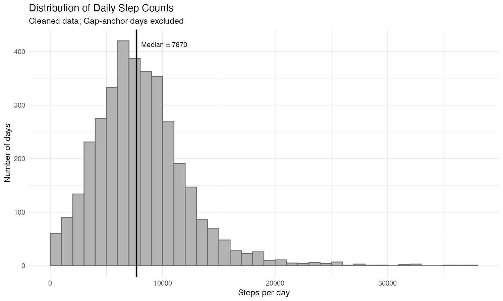
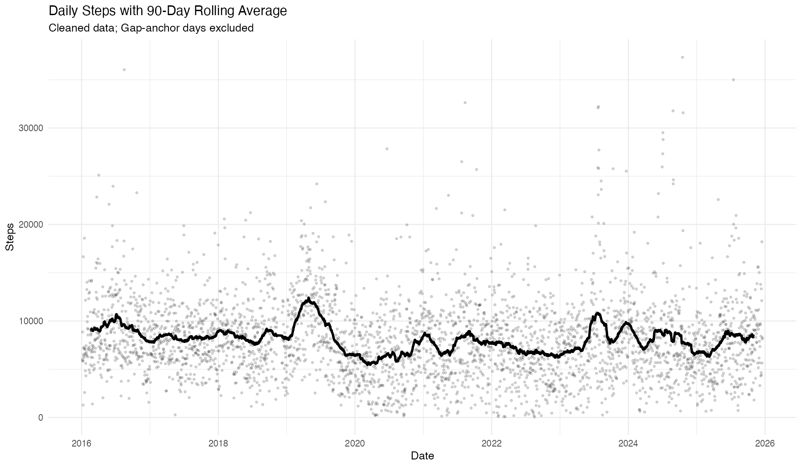
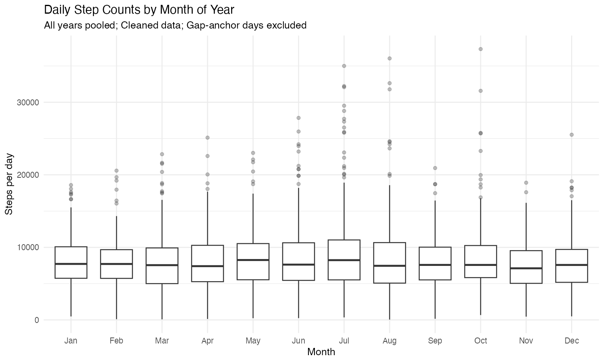

## Overview

This report is a short work sample demonstrating SQL-based extraction and R-based analysis on a longitudinal dataset of daily step counts (2016–2025) exported from Apple Health as an SQLite database. The goal is to show an end-to-end workflow: (1) extract and aggregate raw records into a daily time series, (2) check data quality and document key assumptions, and (3) summarize patterns using clear visualizations.

Because the underlying data are collected through a personal device and synced over time, the raw export contains artifacts that can distort summary statistics and trend estimates if left unaddressed. I identify and exclude anomalous records for the primary plots and briefly describe the validation approach. The emphasis throughout is on reproducibility and defensible communication: making it clear what was done, why it was done, and what the plots do (and do not) support.

## Distribution of Daily Steps

{width=85%}

The cleaned distribution of daily step counts is right-skewed, with most observations clustered between 4,000 and 12,000 steps. The median daily value is approximately 7,700 steps, while extreme values above 25,000 occur infrequently. The skew reflects occasional high-activity days rather than a symmetric distribution centered around the mean. This shape underscores the importance of using medians and rolling summaries when characterizing long-run behavior.

## Long-Run Trend (90-day Rolling Average)

{width=85%}

To reduce day-to-day noise, I use a 90-day rolling average. The smoothed series shows a relatively stable long-run baseline, with notable upward deviations corresponding to high-activity periods rather than sustained structural shifts. Outside of those periods, the central tendency remains fairly consistent across years. This stability reinforces the importance of distinguishing short-term behavioral bursts from longer-run patterns.

## Seasonality (Month-of-Year Distribution)

{width=85%}

Grouping observations by month shows that median daily step counts are fairly consistent across the year. There is a slight widening of the interquartile range during summer months, suggesting somewhat greater variability rather than a substantial shift in central tendency. Overall, seasonal effects appear modest relative to day-to-day variation. The boxplot format helps distinguish changes in spread from changes in the median.

## Data Quality and Reproducibility Notes

The raw data were extracted from a SQLite database and aggregated to daily totals using SQL before analysis in R. Because device-based health data can contain backfill artifacts or delayed sync events, I implemented validation checks to identify anomalous days and exclude them from summary plots. These checks focused on implausible spikes relative to adjacent observations and metadata consistency across records.

All aggregation, cleaning, and visualization steps were scripted to ensure reproducibility. The analysis separates raw exports from cleaned datasets and documents assumptions explicitly so that results can be re-generated from source data.

## Key Takeaways

- The distribution of daily steps is right-skewed, with a median near 7,700 steps.
- Long-run behavior is relatively stable, with deviations driven by identifiable high-activity periods.
- Seasonal differences are reflected more in changes to variability (interquartile range) than in shifts in median daily step counts.
- Careful cleaning and validation are necessary when working with device-sourced longitudinal data.
